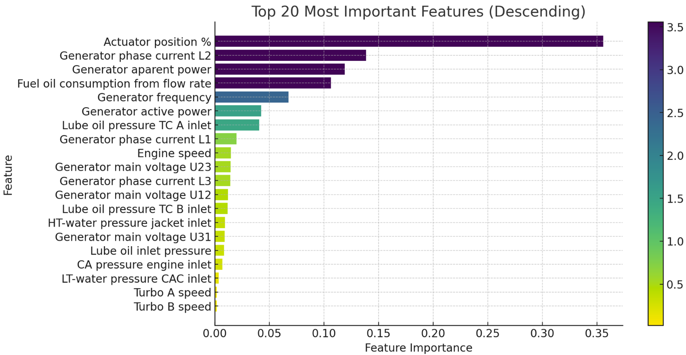
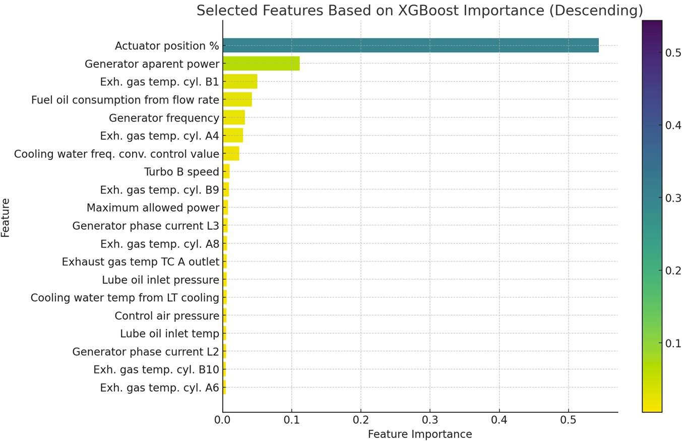
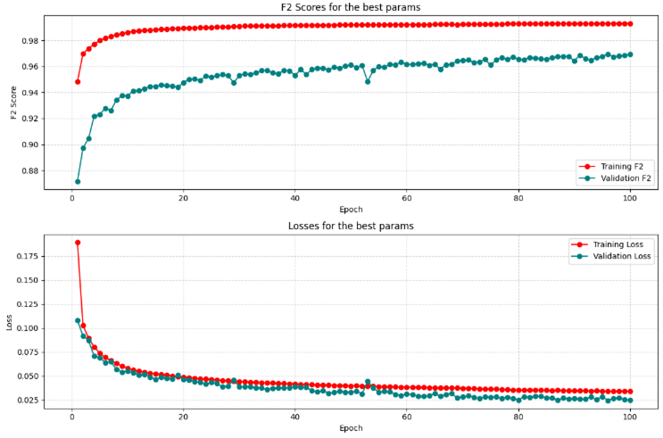
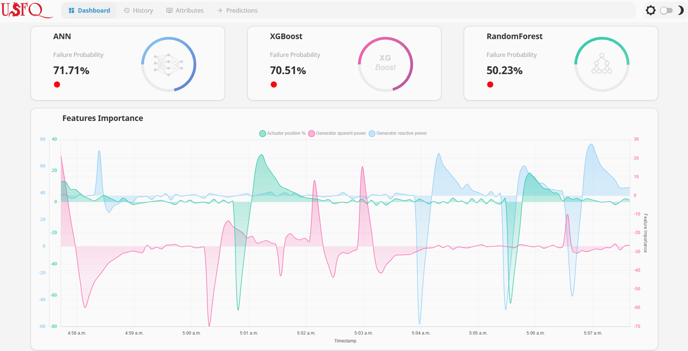

# Supervised Learning for Failure Detection in Engine Generators  
**Leveraging Data Infrastructure, Feature Engineering, and Monitoring via Machine Learning Dashboards**

---

## Overview  
This repository provides the implementation and results of a supervised machine learning approach for failure detection in industrial engine generators. The study is centered around enhancing operational reliability by predicting potential failure events through data-driven insights. It leverages advanced machine learning models such as Random Forest (RF), XGBoost, and Artificial Neural Networks (ANN), integrated seamlessly with the SCADA Ignition platform for real-time monitoring and actionable insights.

---

## Repository Structure  

### 1. **`TrainingDeploy` Folder**
The `TrainingDeploy` folder contains all the source materials and Jupyter Notebooks necessary for training the machine learning models. It includes the complete training workflows for the three models: Random Forest, XGBoost, and Artificial Neural Networks (ANN). 

- **Purpose**: This folder serves as a referential section and is the foundation for building the models used in this project.  
- **Contents**:
  - Jupyter Notebooks for data preprocessing, feature selection, and hyperparameter tuning.
  - Training scripts for each model type.
  - Exploratory Data Analysis (EDA) resources.

### 2. **`RuntimeModel` Folder**
The `RuntimeModel` folder is focused on demonstrating the runtime execution of the models. It includes:
- **Sample Base of Model Attributes**: Contains example configurations of the trained models.
- **Input Data (`input.json`)**: Sample input data for the model in JSON format.
- **Prediction Data (`predictions.json`)**: Contains sample predictions generated by the model in JSON format.
- **Model Output (`output.json`)**: Output from the model showcasing predicted values or classifications.

#### Inside the `RuntimeModel` Folder  
Each algorithm type Random Forest, XGBoost, and ANN contains a dedicated sub-folder named `predictor`, which holds the following:

1. **Model Files**:
   - The trained model is stored as a `.rar` file for easy portability.
   - In some cases, there might be two models:
     - **Best Parameters Model**: The latest version optimized with the best hyperparameters.
     - **Baseline Model**: An initial version of the model used as a starting point for predictions.

2. **Python Scripts**:
   - **`ignition_predict.py`**:
     - This script is executed by the Ignition platform from Inductive Automation.
     - It serves as the main orchestrator for generating predictions from the model.
   - **`ignition_feature_importance.py`**:
     - Also executed by Ignition.
     - Extracts the most important features contributing to the predictions for the corresponding model.
   - **`ignition_clf_attributes.py`**:
     - Used to explore the trained model's attributes, including hyperparameters, tree structure (if applicable), and more.

3. **Additional Files**:
   - Serializable files required for loading the models and their configurations.
   - Sample outputs and reference predictions to validate model performance.

---

## Data Privacy Notice  
**The dataset used in this project is not provided in this repository due to privacy concerns.** The data comes from a private industrial source, and sharing it would compromise confidentiality agreements. Users are encouraged to adapt the provided code and workflows to their own datasets.

---

## Purpose  
This repository is part of the Master's in Data Science program at Universidad San Francisco de Quito (USFQ). It demonstrates how machine learning can be applied to predictive maintenance in industrial environments, integrating advanced algorithms and real-time monitoring systems.

For inquiries, feel free to contact:
- **Email**:  
  - jespinmartin1@gmail.com  
  - jespinm@estud.usfq.edu.ec  

---

## Key Features  
- **Data Handling**: Integration with SCADA systems for data acquisition, cleaning, and transformation of a 26-month dataset comprising 8 million samples and 89 features.
- **Models Implemented**:
  - **Random Forest**: Known for robustness and feature interpretability.
  - **XGBoost**: A gradient boosting model excelling in precision and recall.
  - **ANN (MLP)**: Neural networks capturing non-linear relationships for sophisticated failure predictions.
- **Metrics**: Emphasis on F2 Score to prioritize recall, ensuring no failure events are missed.
- **Visualization**: A machine learning dashboard for real-time predictions and feature importance monitoring.

---

## Project Workflow  

### 1. **Data Acquisition and Preprocessing**
- Data is gathered via a private SCADA Ignition system connected to the generator. 
- Historical and real-time data are stored in structured SQL databases. 
- Steps include:
  - Data merging: Combining raw process variables with manually annotated failure events.
  - Cleaning and transformation: Addressing missing values, normalizing features, and reducing dimensionality.

### 2. **Model Training and Evaluation**
- Models are trained using hyperparameter tuning with cross-validation. 
- Evaluation metrics include confusion matrices, F2 scores, precision, and recall.
- Feature importance analysis is conducted to identify the most critical variables influencing failures.

### 3. **Integration with SCADA**
- Machine learning models are deployed within the SCADA Ignition system using Python scripts. 
- Real-time predictions are provided via the dashboard, offering probabilistic insights into failure risks.

---

## Results  

### Random Forest
- **F2 Score**: 0.9450  
- Key Features:
  - Actuator position % (0.355)
  - Generator phase current L2 (0.139)
  - Apparent power (0.119)



---

### XGBoost
- **F2 Score**: 0.9908  
- Key Features:
  - Actuator position % (0.544)
  - Exhaust gas temperature B1 (0.050)
  - Apparent power (0.112)



---

### ANN (MLP)
- **F2 Score**: 0.95  
- Key Features:
  - Integrated Gradients analysis highlights key variables impacting failures.

Training performance:  


---

## Machine Learning Dashboard  
An interactive dashboard is hosted on the SCADA Ignition platform:
- **Live Predictions**: Real-time failure probabilities.  
- **Feature Importance**: Visual insights into the most critical operational variables.  
- **Historical Analysis**: Explore feature trends over time.  



---

## Installation  
1. Clone this repository:  
   ```bash
   git clone https://github.com/Jonathan-Espin-Martin/DataScience-Master-Degree-Project.git
   cd DataScience-Master-Degree-Project
